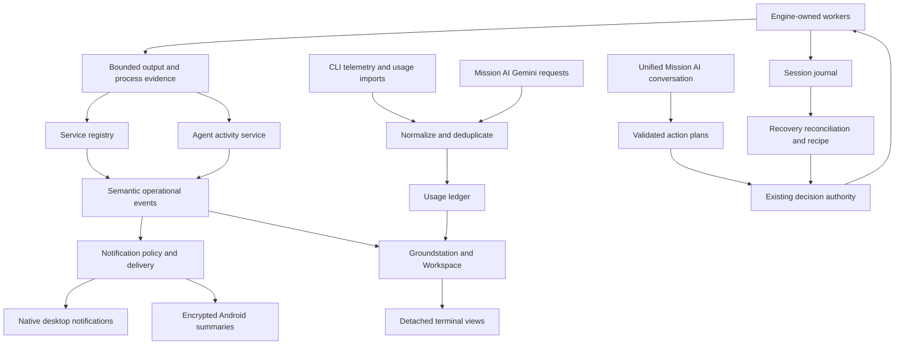

# Mission Control: terminal workspace and intelligence expansion

Prepared 2026-09-07 for the 2.19.0 Refined Source checkout.

Status: architecture analysis and implementation proposal. No application behavior has been changed. Code examples below illustrate proposed interfaces; they are not existing callable APIs unless explicitly identified as current.

## 1. Recommended product direction

Build one terminal-centered workspace with a shared operational model. Every running worker can expose detected services, AI activity, usage, decisions, and recovery information. Groundstation summarizes that same information; a detached terminal presents the same worker in a separate window.

The most valuable change is consistency: clicking a service, an AI completion notification, a cost entry, or a recovery step should always lead to the correct project, worker, and run.

Requested navigation: **Groundstation, Workspace, Needs You, Recipes, History, Settings**. Remove the standalone Agents destination. Put the automatically maintained **AI agents** folder inside Workspace and an **AI activity** register in Groundstation. Keep Mission AI available through a persistent sidebar action and a contextual drawer; Ask and Plan share one conversation.

Use one engine-owned worker model with several views. Do not create a second terminal engine for pop-outs, a separate mission approval system for chat, or a separate cost counter in each window.

## 2. What the current code already provides

These findings come from current source inspection, not assumptions from older audits. This was a targeted architecture review of the requested paths, not a fresh whole-repository runtime audit.

| Capability | Current evidence | Required extension |
|---|---|---|
| Terminal ownership and output | `src/engine/sessionEngine.cjs`: `Session`, `RawReplayBuffer`, `attachRawStream`, output sequence; `src/protocol/index.cjs`: terminal streams and epochs | Cross-window view ownership and persistent worker-run identity |
| Service evidence | `src/engine/evidenceClassifier.cjs`: one `service` fact, URL origin, port, readiness and health hints | Multiple endpoints per run; preserve safe paths; distinguish advertisement from verified availability |
| Port conflicts | `src/service/portInspector.cjs`, `portOwnership.cjs`: listener inspection and descendant ownership | Feed a Services register; revalidate ownership before worker actions |
| Worker presentation | `App.jsx`: `workerKind`, `workerProfile`, automatic folders | Move canonical classification into a service; avoid name-based false positives |
| Worker creation | `WorkerDialog.jsx`, `workerForm.js`: templates, explicit args/env, duplicate-safe IDs | Two-field creation flow and correct shell command handling |
| Layout persistence | `useTerminalLayout.js`: project-scoped local storage, pane sets, layout ratios | Stable slot IDs, detached reservations, main-process recovery snapshot |
| Mission AI | `missionAi.cjs`: Gemini calls, ask and structured plan generation | One conversation coordinator; usage instrumentation and more typed capabilities |
| AI actions | `missionSupervisor.cjs`: create-worker, start/restart/stop, create-profile, run-recipe, terminal-input | Reuse validated plans; improve scoped execution and inline review |
| Mission AI UI | `MissionAIScreen.jsx` and `MissionAI.jsx`: Ask/Plan modes and separate presentation implementations | Shared conversation store and shared message components |
| Recipes | `workspaceRecipes.cjs`, `engine/index.cjs`: dependency/readiness gates, retries, recovery policies | Durable interrupted-run reconciliation and endpoint-specific readiness |
| Desktop alerts | `notificationService.cjs`, `notificationPolicy.cjs`: native delivery, dedupe, quiet hours, rate limiting | Semantic success/completion/service events, Windows Open actions and custom audio |
| Android | `mobileCompanion.cjs`, Android transport and credential store | Background alerts, improved summary UI, narrowly scoped approval review |
| Crash handling | `recoveryController.cjs`, `rendererRecoverySupervisor.cjs`, `diagnosticStore.cjs` | Main/PC crash session journal and launch gate |
| Active visual layer | `main.jsx` imports `redesign/*.css` last; Inter and JetBrains Mono already installed | Edit the authoritative layer and extract components, rather than add another CSS override file |

Important current limitations:

1. Service extraction keeps an origin, so `/health` or `/admin` is lost. It stores one service fact and can match arbitrary links printed in logs.
2. `workerKind()` scans worker names, commands and arguments for strings such as `claude` or `codex`; this can misclassify a shell by its name and miss a CLI launched later inside PowerShell.
3. `NotificationService` deliberately ignores raw output and currently derives notifications from engine attention records. Successful service starts and AI turn completion need semantic events, not raw-output notifications.
4. `MissionAIService.#callGemini()` receives the full response but does not currently turn usage metadata into a durable usage ledger. Key failover state is not a reliable rate-limit model: broad errors can be marked exhausted.
5. `SessionEngine.create()` spawns when `autoStart` is enabled. A recovery screen displayed after normal project loading would arrive too late to prevent unwanted restarts.
6. The normal Electron window closes through app shutdown and uses a single renderer-recovery supervisor. A pop-out cannot reuse that lifecycle unchanged.
7. The generic IPC host creates connections per webContents, while selected standalone IPC handlers explicitly trust only the main window. Add a registered-window capability model before adding pop-outs; do not just weaken the checks.
8. The existing external-open handler allows two fixed documentation URLs. Local service opening requires a new validated service action.
9. Android currently exposes summary reads and a biometric demonstration; the inspected biometric callback updates UI text. It is not yet proof bound to a specific remotely approvable action.
10. This checkout has no usable Git repository metadata (`git status` reports that it is not a Git repository), so no clean/dirty worktree claim is made.

## 3. Shared architecture and identity



Use explicit identities:

| Identity | Lifetime and purpose |
|---|---|
| `projectId` | Stable local workspace identity, including worktree distinction |
| `workerId` | Saved terminal definition |
| `workerRunId` | New ID for each actual worker spawn |
| `serviceGeneration` | New readiness cycle within a worker run; handles in-process dev-server restarts |
| `agentSessionId` / `turnId` | Provider session and response identity where available |
| `missionId` / `recipeRunId` | Explicit attribution captured when work is launched or assigned |
| `windowId` / `slotId` | Presentation location; never worker execution identity |
| `engineEpoch` / `viewLeaseVersion` | Reject stale connections, input and resize after handoff |
| `eventId` / `sourceEventId` | Idempotent delivery and ingestion |

Reusing a worker ID after restart must not reuse old service health, an old pending approval, or old per-run usage. Moving a terminal between windows must not change any execution or billing identity.

Make services publish bounded deltas. Do not refresh every integration or rebuild full Groundstation state on every terminal chunk. Persist operational metadata off the PTY hot path; use a bounded queue and report ingestion gaps explicitly.

## 4. Ports, URLs and Local Services

### Detection and readiness

Add `src/service/localServiceRegistry.cjs` and a pure `src/engine/serviceEndpointParser.cjs`.

Process engine output once, independent of which terminal windows are visible:

1. Decode incremental lines, including split chunks, ANSI sequences, OSC hyperlinks and carriage-return progress output. Bound line length and parser memory.
2. Extract all candidate URLs/listeners, keeping relevant safe paths. Recognize localhost, loopback IPv4/IPv6 and wildcard listener addresses. Normalize `0.0.0.0`/`[::]` to a loopback browser target while retaining the advertised address as evidence.
3. Associate candidates with the worker run and, where practical, the listening descendant process. A printed URL is initially **Detected**, not **Ready**.
4. Confirm availability using listener evidence or a bounded TCP check. Use **Ready — reported by Vite**, **Listening**, and **Health check passed** as different evidence labels.
5. Only request an HTTP path automatically when a detected/configured health contract makes that appropriate. Do not probe arbitrary URLs copied from output: GET can have side effects. Do not invent `/health`, `/admin`, or a database dashboard.
6. Expire stale records on restart, exit or missing listeners, and recheck after resume from sleep. Show timestamps and degraded/unknown states.

Service kinds are optional interpretations: frontend, API, admin UI, database, or unknown. Port 5432 can identify a database listener but cannot create a clickable web admin tool. A frontend preview initially means **Open in browser**; an embedded preview can be a later explicitly selected, isolated surface with no app preload or engine access.

### Exact restart behavior requested

For a worker restart, allocate a new `workerRunId`. For an application-specific `r` restart inside a still-running terminal, retain the worker run and detect a new `serviceGeneration` from adapter restart/readiness evidence. Sending `r` is not itself proof of restart or success.

After new readiness evidence:

> Storefront is ready · localhost:5173 — Open

Deduplicate on project, worker run, endpoint and service generation. Repeated Vite address lines and normal hot reloads should not produce repeated notifications. A failed restart stays failed; never show a success toast because a command was merely sent.

An Open click resolves a service ID against the current registry, revalidates its generation and opens the approved HTTP(S) URL through main-process `shell.openExternal`. If the record is stale, focus the worker with an inline explanation. Never store a shell command inside a toast action.

### Panel design

Use a resizable Workspace bottom drawer with **Services** and **Usage** tabs. Services can also appear as two or three compact rows in Groundstation.

| Service | Address | State | Owner | Actions |
|---|---|---|---|---|
| Storefront | localhost:5173 | Ready · reported 2s ago | Storefront | Open · Copy · More |
| API health | localhost:4000/health | Healthy · checked 5s ago | API | Open · Copy · More |
| PostgreSQL | localhost:5432 | Listening | Database | Copy address · More |

These are illustrative rows, not detections from this checkout. Render each kind only if evidence exists. Empty state: “No local services detected yet. Start a terminal that prints a local address.”

More exposes Stop owner, Restart owner and Inspect port. A worker owning several services has one stop operation affecting all of them; show that impact. Foreign listeners show PID/process evidence and a conflict explanation; offer a reviewed alternative port or guidance, not an automatic kill of an unrelated process.

Validate full URL semantics: allow HTTP(S) only; reject credentials and unsafe schemes; strip or redact secret-bearing query/fragment values; use literal loopback checks or verified local-interface addresses; revalidate redirects and resolved addresses for network probes. Local access is the default; LAN access is a separate explicit setting. Do not persist raw output or authenticated URLs in this registry.

## 5. Cost and Token Usage Monitor

Detailed upstream comparison and primary sources: [Usage tracking research](docs/research/USAGE_TRACKING_RESEARCH.md).

Recommendation: own the normalized usage ledger; use **ccusage as the preferred local CLI-history import/reference candidate**, and official telemetry for live observation. Instrument Mission AI's direct Gemini calls at their request boundary. A proxy-first Langfuse/Helicone/LiteLLM architecture adds infrastructure and does not automatically observe independently authenticated terminal CLIs.

### What to measure

- Provider, model, request count, success/failure, latency and cancellation.
- Input, output, cache-read, cache-write and reasoning tokens where the source exposes them.
- Provider-reported charge when supplied; otherwise a versioned price-based estimate.
- HTTP 429, structured error category, retry-after and reset/remaining values only when observed.
- Project, worker run, provider session, mission and recipe attribution, with confidence/source.
- Coverage: complete, partial, unsupported, stale, or unattributed.

Do not estimate tokens from the number of terminal characters. Do not infer requests from arbitrary log lines. Do not treat context-window capacity, rate-limit windows, prepaid balance and subscription allowance as interchangeable.

### Ingestion and privacy

Add `usageLedger.cjs`, `usagePricing.cjs`, `usageAttribution.cjs`, and provider-specific adapters under `src/service/usageAdapters/`.

Direct API calls: record one attempt for each actual network attempt, including retries and fallback keys. Track logical request ID separately from attempt ID. Record normalized usage even when answer decoding fails after a successful paid response. Missing usage on timeout or transport failure means **unknown**, not zero.

CLI live data: configure supported telemetry/hooks through reviewed integration setup. Some CLIs require launch-time environment/configuration changes and cannot retroactively enable telemetry in an already-running process. Mark that session's coverage and offer enable-on-next-start.

CLI imports: incrementally read known local records, project only allowlisted numeric/identity fields, and discard prompts, tool arguments, responses and credentials. Handle file rotation, truncation, partial JSON, schema changes, resumed sessions and cumulative counters. Pin any bundled helper version and verify its license/platform assets. Never invoke an unpinned package download during app startup.

Deduplicate live telemetry against history imports using provider event/request IDs; where these are absent, use adapter-specific session/counter checkpoints and mark uncertainty. Persist one canonical usage record so a pop-out cannot cause double counting.

Use a transactional local store outside the project repository. SQLite is a sensible target, but this Node 20–22/Electron app needs an explicit compatible driver and packaged Windows rebuild check; do not assume `node:sqlite` is available throughout its supported runtime range. Serialize writes away from terminal rendering. Set retention/export/delete controls.

Attribution must be explicit at launch or through verified provider-session binding. A shared project directory does not identify which of two concurrent missions owns usage. Unmatched imports belong in **Unassigned usage**, not whichever mission is selected when the file is read. Record Mission AI's own requests under Mission AI with the correct project/mission context; account for automatic summaries too.

### Honest cost and allowance display

| Value | UI wording |
|---|---|
| Provider numeric usage | “12.4k tokens · reported” |
| Price table calculation | “$0.08 estimated API cost” |
| Subscription CLI usage | “$0.08 API-equivalent estimate · subscription billing differs” |
| Missing rate-limit data | “Allowance remaining unavailable” |
| Observed quota snapshot | “42% remaining · provider reported · updated 30s ago” |
| User-defined project budget | “$3.20 of $10 local budget · estimated usage” |
| Network failure without usage | “Request failed · usage unknown” |

Do not silently convert unpriced models to zero cost. Store price version, effective date, currency and calculation method. Handle cache and reasoning categories per provider so overlapping counts are not added twice. Keep original charge/estimate separate from an optional user-selected currency conversion.

UI: a compact workspace total opens a detailed Usage drawer with Project / Mission / Terminal scope, model rows, requests, tokens, cost, failures and coverage. Use sortable rows; a small trend is optional. The first release does not need giant cost charts.

Budget warnings should pause or request approval only for future app-controlled work under an explicit policy. Mission Control cannot promise a hard billing cap for third-party CLIs it only observes.

## 6. Detached terminals: at most three

### Visual specification based on the supplied sketch

The inspected image is `D:\Downloads\Untitled-2026-08-31-1837 (1).png`: rounded dark window, very shallow title strip, native-style window controls at the top right, and a bottom-right usage dropdown. Treat its outline colors as identity cues, not a request for a bright full-window border.

Proposed starting dimensions, to validate at Windows display scaling:

- 32 CSS px title bar; 30–34px acceptable after native-control testing. Keep the default main-window 42px title bar separate.
- 2px identity accent and a faint tinted title surface. Slot 1 blue `#60A5FA`, slot 2 violet `#A78BFA`, slot 3 teal `#2DD4BF`.
- Terminal name plus **1 / 2 / 3** identity badge, state dot with accessible label, Recall, minimize, maximize/restore and close.
- 12px title text and existing JetBrains Mono terminal text; no second toolbar row.
- 22px footer with connection state at left and **Usage ▾** at right. Opening the bottom control displays an upward anchored popover so it stays inside the window.
- Restore colors by detached slot, not provider. Use color plus number/name so color blindness does not obscure identity.

```text
╭─ 1  Storefront · Running ───────────── Recall   −  □  × ─╮
│                                                          │
│  Existing terminal viewport                              │
│  Same process, scrollback and working directory           │
│                                                          │
╰─ Connected ─────────────────────────── 12.4k · $0.08 ▾ ───╯
```

Illustrative figures only. Usage popover: session tokens, API-equivalent/estimated cost label, model, request failures, available quota/reset information and data freshness. For an ordinary shell show “No AI usage detected”; do not suggest it is consuming a subscription.

### Reserved original position

Retain the exact `slotId`, grid position and split ratios. Render a static, blurred decorative terminal background with a sharp overlay:

> **Storefront is popped out**
>
> Running in window 1
>
> **Recall here** · Focus window

Keep the placeholder useful if the worker exits: “Storefront is popped out · Process exited.” The blur should be generated decoration, not a screenshot of potentially sensitive output. Unmount or suspend the local xterm view; do not leave a hidden renderer sending resize events.

### Ownership and lifecycle

Add `src/groundstation/main/terminalWindowManager.cjs`, `terminalViewLease.cjs`, and a narrow pop-out preload/renderer entry.

1. Reserve a slot atomically in the main process. Count opening, open and recalling windows toward the global three-window limit.
2. Verify project, worker, run and source slot. Repeated requests for the same worker focus its existing window.
3. Create a hidden, independent BrowserWindow. It must remain movable outside the main window and must not invoke whole-app shutdown when closed.
4. Open a read-only output view using the existing replay/checkpoint protocol. Keep live output buffered while replay catches up.
5. After the new view acknowledges readiness, revoke old input/resize authority and transfer the view lease. Only the active lease may write or resize the PTY.
6. Replace the original view with the reservation and show/focus the pop-out. Failure rolls back the reservation and leaves the original terminal usable.
7. Recall reverses the handoff. Close and Alt+F4 **recall** the terminal; Stop worker remains a separate explicit action.
8. If the pop-out renderer crashes, release its lease, recall to the source slot and record a renderer incident. The worker can remain running.
9. Clamp saved bounds to connected displays and work areas after DPI/monitor changes. A disappeared monitor must not strand the terminal offscreen.
10. If the user changes layouts while a terminal is detached, preserve the original pane set/slot reservation. “Recall here” returns there; if that layout no longer exists, select a deterministic visible fallback and explain it.

Opening a fourth window gives inline feedback: “Three terminals are popped out. Recall one to open another.” Provide the names and Recall actions. No fourth process/window should briefly appear under racing clicks.

Multi-window IPC must use registered webContents and per-window capabilities. A terminal window gets only its worker's stream, usage, detected services and approved contextual actions; it does not receive unrestricted project or settings mutation APIs. Treat the query string as routing information, not authorization. Keep sandboxing, context isolation and navigation denial. Electron recommends sender validation at IPC boundaries: [security guidance](https://www.electronjs.org/docs/latest/tutorial/security).

The current protocol can attach a view to an existing worker. It still needs a lease so competing windows cannot race resize/input. Closing a terminal stream must only detach that view. Never use worker kill/recreate as the pop-out mechanism.

An xterm reconstructed from bounded raw replay may not reproduce every historical scrollback or alternate-screen state perfectly. Validate long-running TUIs, selection, search, IME, resize and active alternate screens; if exact terminal-state continuity fails, add a canonical serialized terminal state/replay strategy before claiming seamless restoration.

## 7. Desktop notifications and Android alerts

### Event policy

Use desktop OS notifications for asynchronous interruptions, with the requested custom sound. Keep History and Needs You as durable records and decision surfaces. These records are not duplicate in-app popup notifications. Ordinary button results remain brief inline feedback.

| Semantic event | Trigger and message | Destination |
|---|---|---|
| `service.ready` | Verified new start/restart: “Storefront is ready” | Open browser |
| `build.failed` | New failed build generation | Focus correct worker/error |
| `agent.awaitingApproval` | Structured, active approval | Review exact decision |
| `agent.turnCompleted` | Provider turn complete: “Codex has a response ready” | Focus terminal, including its pop-out |
| `tests.completed` | Completed test run: counts and result if known | Focus result |
| `service.crashed` | Unexpected process/listener failure | Focus owner/recovery |
| `recipe.blocked` | Dependency/readiness gate blocks progress | Review recipe step |

“Output came” should mean a meaningful completed agent response. A chunk, spinner, token stream or tool log is not a response completion. If no structured signal exists, use “New output available” with conservative debounce and explicit fallback status; never claim the task has finished.

Route events centrally in the desktop main process so three pop-outs cannot generate three notifications. Keep current quiet hours/dedupe/storm protection, adding per-kind choices. Group related service restarts from one recipe into a single actionable completion when appropriate. Acknowledging a notification does not resolve an approval or mark a failed process recovered.

### Windows sound and Open button

This checkout pins Electron **40.10.6**. Its versioned documentation exposes `toastXml` on Windows and labels `sound` as macOS-only; do not implement a Windows ringtone by simply setting `sound: 'ding.wav'`. Newer latest documentation contains APIs absent from this version. [Electron 40.10.6 Notification API](https://raw.githubusercontent.com/electron/electron/v40.10.6/docs/api/notification.md)

Create a Windows notification adapter using custom toast XML and validated action activation, or a narrowly scoped native bridge if packaged activation/audio cannot be made reliable with this Electron version. Validate the action path on the actual pinned runtime: its documentation contains mixed platform labels for action creation/events. If a temporary body-click fallback is used, label it as an incomplete Open-button milestone.

For custom audio, Microsoft documents packaged asset URIs for App SDK notifications; an arbitrary filesystem path is not a universal supported solution. Prove the packaged installer/portable strategy before promising the ringtone. [Windows custom audio](https://learn.microsoft.com/en-us/windows/apps/develop/notifications/app-notifications/app-notifications-custom-audio)

A silent native toast plus app-owned playback can be evaluated as an alternative, but must respect notification/sound settings and Do Not Disturb; playback after a suppressed toast would be poor behavior. Test notification permission disabled, Focus Assist/DND, sound off, minimized app, action-center clicks after restart and missing audio assets. Distinguish requested, shown, failed and acknowledged delivery; `show()` returning is not proof the user heard or saw it.

### Android scope

Reuse the existing encrypted pairing/transport and Keystore-backed device credential. Build three compact screens: Summary, Activity, and Approvals. No terminal input, remote shell, arbitrary command fields or unrestricted execution endpoint.

Phase A: read-only summaries and approval-request notifications. Tapping Review opens the exact project/action summary; desktop resolves the existing approval. This matches the current desktop-gated mutation model.

Optional Phase B: let a paired phone approve explicitly allowed pending desktop plans. This requires a separate `approvals.resolve` scope, exact action digest, expiry, nonce, device identity, project/run binding and server-side revalidation. Tie device biometric confirmation to the actual decision operation; a global “identity verified” UI flag is insufficient. Concurrent desktop/phone decisions use atomic single consumption. Dangerous or unsupported action classes stay desktop-only.

For background alerts, the current same-network companion does not guarantee delivery while Android sleeps or is killed. Use foreground local connection for the first milestone; offer an opt-in encrypted relay/FCM wake-up transport for reliable-away-from-app operation, documenting offline limits. Push payloads carry opaque IDs or encrypted bounded summaries, never terminal output or approval authority. Fetch/revalidate the live decision before acting.

Android Doze delays background work, and FCM priority must match genuinely user-visible urgency. Notification channels let users control categories/sound. [Android Doze](https://developer.android.com/training/monitoring-device-state/doze-standby), [FCM priority](https://firebase.google.com/docs/cloud-messaging/android-message-priority), [notification channels](https://developer.android.com/develop/ui/compose/notifications/channels)

## 8. Crash recovery and session restore

Separate three incidents:

| Failure | Expected recovery |
|---|---|
| One renderer/pop-out crashes | Reattach/recreate view to living engine worker |
| Electron main/engine crashes | Inspect prior journal and surviving process evidence; do not assume PTYs survive |
| PC restart/power loss | Restore layout and historical run facts; offer reviewed starts |

Add `sessionJournal.cjs` and `sessionRecoveryService.cjs`. Store a schema-versioned clean-shutdown marker, host instance identity, run start/end/checkpoint records, worker definition revision, process identity/start time where observable, recipe dependencies and last confirmed service state. Keep command/environment secrets out of this journal: reference trusted saved definitions and credential handles.

Write a launch-intent record before spawn and a confirmed-run record after spawn. Mark clean shutdown only after worker shutdown and persistence succeed. Recover a truncated last record conservatively; retain the last complete snapshot. Bounded checkpoints reduce IO but mean abrupt power loss can lose the most recent observations—display last-confirmed time.

Crucially, add a **recovery launch gate before `EngineAPI.loadProject()` can autostart**. Read definitions into a nonlaunching recovery mode after an unclean session. Preserve saved autostart preferences; do not rewrite them to false simply to suppress this boot.

Reconcile each previous worker:

- **Running and reconnectable** only when the engine still owns a usable terminal transport.
- **Process observed, terminal unavailable** when a surviving process is identified but cannot be reattached.
- **Exited** when supported by recorded exit evidence.
- **Interrupted / state unknown** after lost ownership or crash without an exit record.
- **Ready to restart after review** only when definition, dependencies, ownership and port checks pass.

PID alone is not identity because Windows can reuse it. Compare process start identity and executable evidence, avoiding secret-bearing command-line persistence. Do not claim an old Windows ConPTY can be reattached after its owner dies. A separate durable engine daemon could improve that later, but is a larger architecture change, not required for the first recovery recipe.

Recovery UI: restore layout immediately, show a compact “Previous session ended unexpectedly” banner and a review drawer containing Worker / Last state / Current evidence / Proposed action. Default to review; explicit selection creates a recovery recipe.

Run dependencies first, use service/health gates before downstream steps, reuse verified living owned workers, and stop on failed prerequisites. Never automatically rerun migrations, deployments or destructive scripts from a stale last-command capture. Bind approval to current definitions and detect edits before execution. Old pending approvals expire across an unclean engine epoch.

By default restore previously detached workers into their reserved main-workspace slots and offer **Restore detached windows (up to 3)** after reconciliation. This keeps layout recoverable without unexpectedly opening several windows after a crash.

## 9. Mission AI as the unified app interface

Give Mission AI broad **app capability coverage**, through typed tools with existing engine authority. It should understand services, worker state, recipes, usage, mission context and recovery; it should be able to propose changes to all relevant workflows. Terminal logs and repository text remain evidence, not instructions that grant authority.

### One conversation

The same thread accepts:

- “What is running?” → an evidence-backed answer with worker links.
- “Create a terminal called Storefront and run npm run dev.” → a concrete worker plan with exact command/directory and Start action.
- “Make a recipe for the API and frontend, waiting for the API first.” → a dependency graph and reviewed recipe definition.
- “Why is port 3000 unavailable?” → ownership evidence and a proposed action.
- “How much has this mission used?” → ledger query with coverage/cost labels.
- “Recover what was running before the crash.” → a reviewed recovery recipe.

No separate Ask/Plan pages or forced mode switching. Return mixed content: answer, evidence links, draft action cards, approval state, execution result and verification. Keep one stable conversation when opening the drawer from a terminal or expanding it into a larger overlay.

Use `missionAi.conversation.send` as a proposed coordinator API. It can call existing `missionAi.ask` / `missionSupervisor.plan` internally during migration. Existing `missionSupervisor.approval.resolve` remains execution authority. Render the same decision record inline in chat and in Needs You; resolving either updates both. No duplicate approvals.

### Capability expansion

| Class | Examples | Behavior |
|---|---|---|
| Read | list workers/services, inspect usage, summarize failures | No mutation; bounded evidence |
| View | focus worker, show service, arrange panes | Reversible user-requested view action |
| Draft | create recipe draft, propose terminal definition | Visible editable proposal |
| Execute | create/start/restart/stop worker, save/run recipe | Exact reviewed action through EngineAPI |
| Sensitive | change credentials/permissions, destructive shell actions | Explicit focused review; secrets entered via Settings |

Current `create-profile` already bundles worker definitions and a normalized recipe. Reuse it initially; later expose clearer create-recipe/update-recipe domain actions. Keep compatibility adapters while migrating labels and tests.

Expand plan validation to capture revision/digest, project, affected run, dependencies and idempotency key. Revalidate immediately before execution. Report partial success honestly and offer a follow-up recovery plan; never claim rollback undoes arbitrary shell side effects.

The current validator requires a single executable and separate arguments; it is not a security boundary for all possible commands because interpreters can execute scripts via arguments. Assess the complete launch semantics and show the exact proposed command. Do not add a broad `eval`/raw IPC escape hatch for AI convenience.

Avoid a costly loop where AI continuously reads its own summaries and creates more summaries. Summarize material state changes with debouncing, cache by evidence digest and budget automatic calls. Without an API key or network, local detection and terminal control still work.

## 10. Automatic AI-agent classification and activity

Move `workerKind()`'s classification out of React into `agentActivityService.cjs`. Mission AI owns the user-facing explanation and resolves ambiguous evidence, while local process/adaptor signals make routine classification fast and available offline.

Evidence order: explicit provider session telemetry → recognized active child process executable → known CLI lifecycle signatures → bounded Mission AI interpretation. A worker name containing “Codex” is insufficient. Plain PowerShell starts as Shell; launching Claude inside it becomes AI agent for that active run/session; exiting Claude returns it to Shell.

Use `agent: true/false/unknown`, provider, state, confidence, evidence references, detectedAt and lastUpdatedAt. Never treat a model's classification as process truth. Offer a small “Correct classification” action and retain the correction against the appropriate worker/run policy. Do not move the actual pane when its folder membership changes; the folder is a filtered view.

States: Starting, Working, Waiting for approval, Response ready, Idle, Failed, Unknown. For process wrappers and multiple child agents, preserve child session identities rather than overwrite everything with the latest line.

Groundstation's AI activity register should show:

```text
Codex · Payments     Working          Running checkout tests       8s ago
Claude · API         Needs approval   Wants to run database setup   Review
Gemini · Docs        Response ready   Documentation update ready    Open
```

These are illustrative. “Running checkout tests” needs evidence such as a tool/process event. An LLM-only interpretation is labeled “AI summary,” with a timestamp and evidence link. Never invent percent complete or a task-finished state from silence.

Prefer CLI lifecycle integrations for completion: Claude exposes Stop/Notification hooks and Gemini exposes AfterAgent/Notification hooks; verify installed CLI support during setup. Drop prompt/tool payloads at ingestion and use only required state identifiers. [Claude hooks](https://code.claude.com/docs/en/hooks), [Gemini hooks](https://geminicli.com/docs/hooks/reference/)

Removing Agents navigation must migrate existing deep links, command-palette entries, favorites and tests. Preserve engine missions, adapter launch support and approvals; make them reachable from Workspace, Groundstation and Mission AI.

## 11. Simple Add terminal dialog

Default UI, exactly aligned with the request:

```text
Add terminal

Name
[ Storefront                              ]

Start command
[ npm run dev                             ]

Project: my-project

                                  Cancel   Start
```

Remove Frontend/Backend/Git/Docker template choices, role selection, JSON arguments, environment editor and editable worker ID from the default creation flow. Auto-generate a collision-safe stable ID. Inherit the active project and configured shell. Preserve advanced configuration in Edit terminal / Settings if needed by existing workers.

A friendly start-command field changes command semantics. Do not split on spaces: quoting, paths with spaces, PowerShell expressions and Windows `.cmd` shims require a defined execution path. Store an explicit distinction between a shell command line and executable-plus-args. Run user command text through the selected shell's supported invocation method, without concatenating project paths or environment values into it. Preserve exact reviewed text; test quotes, Unicode and whitespace.

Default shell should remain open after the startup command if the intended worker is an interactive terminal, with a clear failed-command state. Decide this through an explicit launch policy, not by appending shell operators blindly. Commands entered directly by the user are authorized by Start; AI-generated launch plans remain reviewable.

Show the created pane immediately in Starting state, keep the dialog open on creation failure, disable duplicate submission, and report command failure in the terminal/worker state. Keyboard: initial focus on Name, Enter submits where appropriate, Escape cancels, focus returns to the invoking control, footer remains visible at small heights.

## 12. Workspace redesign specification

```text
┌ Sidebar ───┬ Project / branch       Layout ▾     Pop-outs 2/3   + Terminal ┐
│ Groundstn  ├ All terminals   AI agents 2   Services 2    My folder          │
│ Workspace  ├──────────────────────────────┬───────────────────────────────┤
│ Needs You  │ Storefront                ↗  │ API                        ↗  │
│ Recipes    │                              │                               │
│ History    │ Terminal                     │ Terminal                      │
│ Settings   ├──────────────────────────────┼───────────────────────────────┤
│            │ Codex                        │ Tests                         │
│ Mission AI │ Codex is popped out          │ Terminal                      │
│            │ Recall here · Focus window   │                               │
│            ├──────────────────────────────┴───────────────────────────────┤
│            │ Services 2   Usage $0.14 est.      Connected                  │
└────────────┴──────────────────────────────────────────────────────────────┘
```

Illustrative content. Mission AI opens in a resizable right drawer; the bottom Services/Usage drawer opens on demand. Avoid opening both drawers by default. At narrow widths use one overlay drawer at a time so the terminal stays readable.

Design principles:

- Keep sidebar navigation. Use dense rows, compact labels and one primary action per surface.
- Retain Inter for UI and JetBrains Mono for terminal/code. Use tabular numerals for metrics.
- Neutral charcoal surfaces, readable gray text, thin borders and restrained accents. Reserve red/amber/green for status; pop-out identity colors occupy a separate channel.
- Put repeat actions in consistent positions: pane title at left, view actions at right, Stop/Restart in More with clear labels and impact.
- Keep terminal content visually dominant. Target at least roughly 75% content height for terminal viewport when drawers are closed; measure on real supported dimensions.
- Use 120–180ms opacity/position transitions for drawer entry and state changes. Avoid animating terminal rows or dragging an expensive blur texture across the viewport. Respect reduced motion.
- Make resizing continuous and predictable; save settled ratios, not every animation frame. Give handles larger invisible hit targets and keyboard alternatives.
- Default 13px UI/terminal readability with adjustable terminal font size; metadata should remain legible rather than being compressed to decorative microtext.
- Use accessible labels and tooltips for compact buttons, visible keyboard focus, screen-reader state changes and adequate text contrast. Colors never carry state alone.
- Validate at the app's current 800px minimum width and real 100/125/150/200% Windows scaling. Pop-outs need their own smaller layout acceptance matrix. Android uses its own touch layout, not the desktop terminal grid.

The UI skill's generated suggestions included a marketing-style horizontal journey and unrelated typography. They are unsuitable here; this proposal instead follows the supplied terminal sketch, existing fonts and the requested dense operational workflow.

Extract `WorkspaceView`, `TerminalHeader`, `DetachedTerminalPlaceholder`, `ServicesPanel`, `UsagePanel`, `AgentActivityRegister`, `MissionAIConversation` and `RecoveryReview`. Reuse the same leaf components across main and detached windows. Edit existing authoritative redesign files and remove conflicting rules as components migrate.

## 13. Proposed code contracts

### A. Usage record shape

Illustrative TypeScript notation documenting a runtime schema; the current backend is CommonJS JavaScript. Enforce an equivalent schema before persistence.

```ts
type UsageRecord = {
  version: 1;
  eventId: string;
  provider: string;
  model: string | null;
  source: 'api' | 'telemetry' | 'local-import';
  sourceEventId: string | null;
  projectId: string | null;
  workerId: string | null;
  workerRunId: string | null;
  agentSessionId: string | null;
  missionId: string | null;
  recipeRunId: string | null;
  logicalRequestId: string | null;
  attemptId: string | null;
  at: number;
  outcome: 'success' | 'failed' | 'cancelled' | 'unknown';
  httpStatus: number | null;
  latencyMs: number | null;
  tokens: {
    input: number | null;
    output: number | null;
    cacheRead: number | null;
    cacheWrite: number | null;
    reasoning: number | null;
  };
  countSemantics: 'disjoint' | 'provider-overlapping' | 'unknown';
  cost: {
    amount: number | null;
    currency: string;
    basis: 'reported-charge' | 'estimated-api' | 'api-equivalent' | 'unknown';
    priceVersion: string | null;
  };
  attribution: 'explicit' | 'session-match' | 'unassigned';
  coverage: 'complete' | 'partial' | 'unknown';
};
```

No prompt, response, environment, raw error body, secret, or full command field belongs in this record. Rate limits are a separate timestamped provider/account-scope snapshot rather than a sum of these usage records.

### B. Proposed terminal view lease

```ts
type TerminalViewLease = {
  projectId: string;
  workerId: string;
  workerRunId: string;
  engineEpoch: string;
  ownerWebContentsId: number;
  slotId: string;
  leaseVersion: number;
  state: 'docked' | 'opening' | 'detached' | 'recalling';
  detachedSlot: 1 | 2 | 3 | null;
};
```

Check lease ownership in main/protocol handling for terminal write and resize, not only in React. The runtime also needs a handoff generation to discard acknowledgements from a window that timed out.

### C. Proposed protocol additions

| Method | Input concept | Authority |
|---|---|---|
| `services.list` | project + optional worker run | Read filtered state |
| `services.open` | service ID + expected generation | Validated main-process browser open |
| `services.copy` | service ID | Copy sanitized canonical address |
| `usage.query` | scope, period, grouping, cursor | Read numeric aggregate/provenance |
| `terminal.window.detach` | worker + source slot + expected run | Registered desktop view operation |
| `terminal.window.recall` | detached identity + generation | Same worker view operation |
| `terminal.window.focus` | detached identity | Window focus only |
| `recovery.inspect` | project ID | Read reconciliation report |
| `recovery.propose` | selected report items + revision | Creates approval-bound recovery plan |
| `missionAi.conversation.send` | thread + message + context refs | Read/draft; execution still uses decisions |

Add method validation, capability checks, response schemas and event subscriptions together. Existing `terminal.open/activate/write/resize/close` remain the stream transport. Keep existing consumers working; introduce capability negotiation for new methods rather than silently changing Protocol v1 semantics.

### D. Concrete action example using the existing supervisor vocabulary

For “Create Storefront and start npm run dev,” the current plan model can represent the following. This is a proposed plan body, not an instruction to execute it during this analysis. Generate a fresh ID in production and validate executable availability and the current project before approval.

```json
{
  "summary": "Create and start the Storefront terminal in this project.",
  "assumptions": ["The project has an npm dev script."],
  "actions": [
    {
      "type": "create-worker",
      "reason": "Create the terminal requested by the operator.",
      "definition": {
        "id": "storefront-example",
        "name": "Storefront",
        "command": "powershell.exe",
        "args": ["-NoLogo", "-NoProfile", "-NoExit", "-Command", "npm run dev"],
        "cwd": ".",
        "autoStart": false
      }
    },
    {
      "type": "start",
      "reason": "Run the reviewed startup command.",
      "workerId": "storefront-example"
    }
  ]
}
```

The executor creates the definition, starts it only after approval, then the service registry waits for a new endpoint/readiness event. The UI must not label the frontend ready merely because the second action returned successfully. In this interactive PowerShell example, an npm command failure can leave the shell alive; command/service evidence must distinguish that from successful application startup.

### E. Proposed file ownership

| Area | Modify | Add |
|---|---|---|
| Services | `sessionEngine.cjs`, `evidenceClassifier.cjs`, `portInspector.cjs`, protocol | endpoint parser, local service registry |
| Usage | `missionAi.cjs`, app state subscriptions | ledger, pricing, attribution, adapters, UsagePanel |
| Windows | main `index.cjs`, `ipcHost.cjs`, protocol, `TerminalPane.jsx`, layout hook | terminal window manager, lease, restricted preload, pop-out renderer |
| Notifications | notification service/policy and main wiring | semantic event router, Windows adapter/audio assets |
| Recovery | `engineHost.cjs`, engine load path, workspace configuration migration | journal, reconciliation service, RecoveryReview |
| Mission AI | both current AI UI implementations, supervisor, decision broker | conversation service/store and shared thread components |
| Classification | `App.jsx` role helpers, agent adapters, project supervision | agent activity service and provider event adapters |
| Creation/design | WorkerDialog, workerForm, App, redesign CSS | shell launch model and extracted workspace components |
| Android | Java companion UI/transport, manifest, desktop mobile gateway | channels, alerts transport, optional scoped decision review |

## 14. Delivery order

Do not implement every UI first and fill in invented metrics later. Each stage should expose real data and have a complete usable path.

1. **Shared identities and recovery launch gate.** Establish run IDs, event envelopes, capability registry and migration strategy. Add documentation/fixtures for existing contracts.
2. **Workspace foundation and simple terminal creation.** Extract components, simplify dialog, preserve layouts and remove Agents navigation with redirects. Keep existing behavior reachable.
3. **Services and desktop readiness notifications.** Complete start → detect → verify → notify → Open, then restart/conflict paths.
4. **Detached terminals.** Deliver lease handoff, three-window cap, placeholders, recall, failure recovery and compact title bar. Usage initially has a truthful unavailable state.
5. **Usage ledger.** Start with direct Mission AI requests, then one CLI end-to-end, then other providers and imports. Connect the same data to pop-outs and Groundstation.
6. **Automatic agent activity and unified Mission AI.** Add evidence-backed grouping, completion signals, shared conversation and inline reviewed actions.
7. **Durable crash-recovery recipe.** Journal, reconcile, approve, run dependency-aware recovery and verify effects. Include main process and PC-loss simulations.
8. **Android alerts and packaging validation.** Read-only/desktop-reviewed first; remote approval scope and relay only after their separate acceptance gates.

Before committing to a schedule, timebox four engineering spikes: exact terminal handoff, pinned Electron Windows toast action/audio, installed CLI telemetry correlation, and pre-autostart crash reconciliation. These determine the largest uncertainties. A reliable whole-feature release is several increments, not a single cosmetic redesign pass.

## 15. Acceptance register

Every box below represents required implementation/validation work, not completed tests.

### Services

- [ ] S01 Extract multiple local endpoints across split ANSI/OSC output without rendering arbitrary links as services.
- [ ] S02 Preserve detected health/admin paths; do not synthesize missing tools or endpoints.
- [ ] S03 Handle IPv4, IPv6 and wildcard binds with valid browser addresses.
- [ ] S04 Distinguish Detected, Listening, Ready, Healthy, Failed and Stale with evidence timestamps.
- [ ] S05 Fresh worker restart invalidates old readiness and emits one verified-ready notification.
- [ ] S06 In-terminal `r` restart uses a service generation and requires new success evidence.
- [ ] S07 Open and Copy work from panel, Groundstation and notification for the correct current service.
- [ ] S08 Stop/restart affects the identified owning worker and explains multi-service impact.
- [ ] S09 Foreign port conflicts are identified without killing unrelated processes.
- [ ] S10 URL credentials/secrets, unsafe schemes, redirects and stale toast actions are handled safely.

### Usage

- [ ] U01 Record direct Gemini success, failure, retry, fallback and cancellation attempts without payload content.
- [ ] U02 Keep usage if a paid successful response later fails answer decoding.
- [ ] U03 Missing usage stays unknown; unsupported pricing does not become zero.
- [ ] U04 Verify each CLI adapter using representative installed-version fixtures and documented telemetry.
- [ ] U05 Handle cumulative tokens, cache/reasoning overlap and resumed sessions without double counting.
- [ ] U06 Deduplicate history import against live telemetry and survive log rotation/truncation.
- [ ] U07 Attribute project/mission/worker runs explicitly; retain ambiguous records as Unassigned.
- [ ] U08 Main window and all pop-outs display the same scoped totals after reconnect/restart.
- [ ] U09 Distinguish actual charge, estimated API cost and subscription API-equivalent usage.
- [ ] U10 Show quota remaining only when observed; expose freshness, reset and unknown coverage.
- [ ] U11 Persist/export/delete metadata with retention limits and no prompts, output or secrets.
- [ ] U12 Validate native helper/SQLite packaging on supported Windows architectures before bundling.

### Detached terminals

- [ ] P01 Pop-out/recall retains the same worker process and run identity.
- [ ] P02 Maximum three counts opening/closing races; duplicate requests focus the existing window.
- [ ] P03 Placeholder preserves exact name, slot and split geometry with readable Recall here.
- [ ] P04 Only one view has input/resize authority during every handoff phase.
- [ ] P05 Failed window creation/replay readiness rolls back to a usable docked pane.
- [ ] P06 Close/Alt+F4 recalls; Stop worker remains separate; app quit still shuts down correctly.
- [ ] P07 Terminal content, alternate screen, IME, keyboard shortcuts and Unicode survive movement acceptably.
- [ ] P08 Title bars remain compact and distinguishable by number/name/color at Windows scaling levels.
- [ ] P09 Usage popover stays inside the window and distinguishes unknown subscription allowance.
- [ ] P10 Renderer crash, main renderer reload, removed monitor and project switch cannot strand a worker/window.
- [ ] P11 Restricted pop-out IPC rejects other worker/project access and unregistered senders.
- [ ] P12 Layout changes while detached have deterministic recall behavior.

### Notifications and Android

- [ ] N01 Deliver requested semantic events; no notification per terminal chunk/token/spinner update.
- [ ] N02 Deduplicate globally across main and three detached renderers and repeated recipe events.
- [ ] N03 Desktop only for popup interruptions; History/Needs You retain durable state.
- [ ] N04 Windows Open action works on pinned Electron and packaged builds, including stale activation.
- [ ] N05 Custom sound works through the selected Windows adapter and respects quiet/silent/DND settings.
- [ ] N06 Permission denial and asynchronous delivery failure remain distinguishable from successful display.
- [ ] N07 AI response notification focuses the correct detached/docked terminal.
- [ ] N08 Android summaries omit terminal output, prompts, source and credentials.
- [ ] N09 No Android terminal-control endpoint or arbitrary command input exists.
- [ ] N10 Background delivery is tested under Doze, app kill, offline desktop and device revocation.
- [ ] N11 Optional phone approvals bind biometric/device proof to one unexpired unchanged action; replay and racing decisions fail.

### Recovery

- [ ] R01 Unclean launch inspection runs before any normal autostart path.
- [ ] R02 Preserve saved autostart preferences while suppressing this recovery boot's launches.
- [ ] R03 Separate renderer-only recovery, main/engine loss and PC restart in state and copy.
- [ ] R04 Restore layout, names, ratios and detached reservations from versioned state.
- [ ] R05 Handle missing/corrupt/truncated journal and checkpoint gaps without false running/exited claims.
- [ ] R06 Reconcile PID reuse, foreign surviving processes and unavailable ConPTY ownership.
- [ ] R07 Recovery recipe rechecks commands, dependencies, ports and definitions before approved execution.
- [ ] R08 Do not rerun migrations/destructive operations or resume old approvals automatically.
- [ ] R09 Partial recovery failure blocks dependent starts and gives evidence-backed next actions.

### Mission AI, classification and UX

- [ ] A01 One conversation handles answers and plans without separate Ask/Plan pages.
- [ ] A02 Create terminal, create/save/run recipe, inspect service and query usage work through typed capabilities.
- [ ] A03 Chat and Needs You share the exact approval record and execution result.
- [ ] A04 Changed/expired plans fail revalidation; partial success is reported accurately.
- [ ] A05 Plain PowerShell is not an agent based on its name; entering/exiting a recognized CLI updates classification.
- [ ] A06 Ambiguous classification is explainable/correctable and local fallback works without Mission AI.
- [ ] A07 Groundstation summaries include source/time and never invent completion percentages or finished tasks.
- [ ] A08 Remove Agents navigation while preserving missions, adapters, approvals and old-link routing.
- [ ] A09 Two-field Add terminal handles quoting, spaces, Unicode, `.cmd` launch, errors and duplicate submits.
- [ ] A10 Existing saved worker configurations/presets migrate without deleting commands or credentials.
- [ ] A11 Workspace drawers, dialogs, popovers and title controls pass keyboard/focus/contrast/reduced-motion checks.
- [ ] A12 Terminal area remains usable at 800px main-window width and smaller accepted pop-out dimensions.
- [ ] A13 Sustained high-volume output plus three pop-outs does not block input; measure latency/memory versus baseline.
- [ ] A14 Automatic AI summaries obey budgets/debounce and are counted in usage.

## 16. Validation and practical limits

Current work verified source paths, the supplied reference image, package/runtime versions and upstream documentation. No app launch, mobile build, notification sound playback, CLI log ingestion or new-feature tests have been performed during this planning pass.

Implementation should extend existing suites such as `sessionEngine`, `protocol`, `engineApi`, `terminalWorkspaceLayout`, `missionAi`, `notifications`, `recovery`, `mobileCompanion`, `workspaceRecipes2` and renderer contract tests. Add behavioral integration tests for handoff concurrency, real process ownership, stream continuity, usage attribution and recovery launch ordering. Regex/source-presence tests alone cannot prove these behaviors.

Run focused tests per increment, then the required full suite and Groundstation build. Complete real Windows acceptance for ConPTY, scaling, multi-monitor behavior, custom audio and installed notifications, plus Android device acceptance for background delivery. Documentation/source support does not equal a verified packaged integration.

The strongest differentiator is a single contextual operational loop: see a problem, understand its evidence, approve the right action, verify the service/result, and see its usage—all linked to the same terminal and mission.
