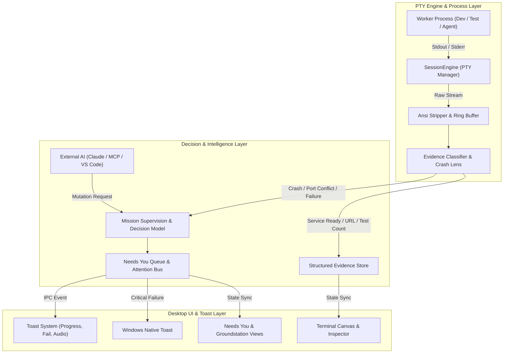

# OUTARCH (Mission Control) — Comprehensive Application Architecture & Operational Manual

> **Document Type:** Deep System & Operational Analysis  
> **Target Version:** OUTARCH 2.19.0  
> **Audit Status:** Complete Source-Code Review  

---

## 1. Executive Summary: What Does This App Do?

**OUTARCH** (formerly known as **Mission Control**) is a **local-first developer cockpit and terminal command center** designed for Windows, macOS, and Linux. It is built on a unified Node.js architecture with two primary interfaces:
1. **Groundstation Desktop Client:** An Electron + React 18 + xterm.js application providing multi-pane interactive terminal workspaces, intelligent evidence supervision, automated DAG recipes, and integration bridges.
2. **TUI Client:** An Ink-based terminal user interface providing terminal supervision and recovery capabilities.

### Core Problem It Solves
Modern software development requires running multiple concurrent long-lived processes: frontend development servers, backend APIs, microservices, databases, Docker containers, test runners, Git commands, and autonomous AI agents (e.g. Claude Code, Codex, Gemini CLI, OpenCode).
- Traditional terminal emulators force developers to manually switch between windows and constantly check logs to see if a command failed or finished.
- OUTARCH introduces **Supervision by Exception**: it owns native PTY sessions, analyzes terminal streams in real time, extracts structured evidence, and surfaces actionable notifications and decisions *only* when human judgment or intervention is needed.

---

## 2. Architecture & File Structure

```
nvkh-main/
├── bin/
│   └── termctl.js                      # CLI entry point (start TUI / launch Groundstation)
├── src/
│   ├── engine/                         # Core Node.js process engine & supervisors
│   │   ├── sessionEngine.cjs           # Authoritative PTY session lifecycle (node-pty / ConPTY)
│   │   ├── evidenceClassifier.cjs      # Stream parser for tests, builds, git, ports, containers
│   │   ├── classifier.cjs              # Process output pattern matcher
│   │   ├── activityStore.cjs           # Append-only chronological workspace event log
│   │   ├── missionSupervision.cjs      # Unified Decision Model & checkpoint validation
│   │   ├── workspaceRecipes.cjs        # Multi-worker startup DAG engine with readiness checks
│   │   ├── workspaceConfig.cjs         # Workspace persistence and configuration
│   │   ├── workspaceLease.cjs          # Single-instance file-locking lease management
│   │   ├── resourceSampler.cjs         # Worker CPU and memory monitoring
│   │   ├── serviceEndpointParser.cjs   # URL / port detection and health checking
│   │   ├── aiProvider.cjs              # Multi-LLM provider integration (Gemini, OpenAI, Anthropic)
│   │   └── automationWorkflows.cjs     # Automation triggers, cooldowns, and approval gates
│   ├── groundstation/                  # Electron Desktop Application
│   │   ├── main/                       # Electron Main process
│   │   │   ├── index.cjs               # Main process entry point & window manager
│   │   │   ├── ipcHost.cjs             # IPC handler exposing EngineAPI to renderer
│   │   │   ├── terminalWindowManager.cjs# Detached popout terminal window controller
│   │   │   └── workspaceBrowser.cjs    # Embedded WebContentsView browser controller
│   │   ├── preload/
│   │   │   └── index.cjs               # Context-isolated secure bridge (window.missionControl)
│   │   └── renderer/                   # React 18 frontend UI
│   │       ├── App.jsx                 # Master application controller, routing & hotkeys
│   │       ├── TerminalPane.jsx        # Xterm.js terminal instance with CrashLens
│   │       ├── DecisionList.jsx        # "Needs You" decision triage list
│   │       ├── MissionAIScreen.jsx     # Conversational AI assistant full screen
│   │       ├── AssistantChat.jsx       # Chat thread, tool approvals, and command runs
│   │       ├── RecipesView.jsx         # Workspace launch recipes manager
│   │       ├── MissionGraph.jsx        # Interactive visual DAG dependency graph
│   │       ├── ToastSystem.jsx         # Multi-tiered actionable toast notification system
│   │       ├── IntegrationsView.jsx    # Hub for AI, VS Code, MCP, and Mobile Companion
│   │       ├── McpGateway.jsx          # Model Context Protocol server configuration
│   │       ├── MobileCompanion.jsx     # Encrypted Android LAN pairing setup
│   │       └── BroadcastBar.jsx        # Multi-terminal synchronized command execution
```

---

## 3. View-by-View Functional Breakdown

### 1. Groundstation View (Dashboard / Pulse)
- **Most Urgent Decision Card:** Prominently displays the highest-priority pending problem (e.g. process crash, port collision, or agent tool approval).
- **Needs You Attention Inbox:** Summarizes pending decisions with direct *Restart*, *Acknowledge*, and *Decide* actions.
- **Worker Manifest Grid:** Displays all configured workers with status tags (`live`, `idle`, `review`, `failed`), role icons, live CPU/memory metrics, runtime duration, and last output timestamps.
- **Worker Inspector (Slide-out Rail):** Opens upon selecting a worker. Displays the full command, cwd, auto-start restore toggle, structured evidence badges, recent terminal lines, and a 1-click **"Ask Mission AI"** contextual button.
- **Activity Waterline ("NOW"):** Displays a real-time event feed of workspace transitions.
- **Saved Recipes Strip:** Quick-launch cards for saved workspace stacks.

### 2. Workspace View (Multi-Terminal Canvas)
- **Top Command Deck:**
  - Layout switchers for 1-pane, 2-pane (horizontal/vertical), 4-pane grid, 6-pane grid, and auto-packed mosaic modes.
  - Live worker search filter to dynamically map any background process to the focused pane.
  - Live vs. Idle worker counts.
  - Quick action buttons: **Add Terminal Worker**, **Toggle Browser**, **Toggle Assistant**, **Recipes**, and **Focus Mode**.
- **Tiled Terminal Canvas:**
  - Powered by `@xterm/xterm` with `@xterm/addon-fit`.
  - Draggable borders for live resizing with double-click auto-even.
  - Directional keyboard navigation with `Alt + Arrow Keys`.
- **Fullscreen Focus Mode (`Alt + F`):**
  - Collapses the navigation sidebar and top status bar to allocate 100% of display area to terminals.
- **Embedded Workspace Browser (`Alt + B`):**
  - Mounts an Electron `WebContentsView` directly beside your terminals to interact with local web servers (`http://localhost:3000`).
- **Workspace AI Assistant Pane (`Alt + C`):**
  - Side-by-side chat assistant that reads terminal outputs and executes authorized fixes.
- **Workspace Ops Drawer (Bottom Rail):**
  - **Services Panel:** Live detected local ports and URLs with options to **Copy**, **Open in OUTARCH Browser**, **Open in System Browser**, or **Inspect Port**.
  - **Usage Panel:** LLM token and cost tracking grouped by provider and model.
  - **Detached Windows Counter:** Tracks terminals popped out into external native OS windows.

### 3. Needs You View (Unified Decision Room)
- **Prioritized Decision Queue:** Centralized triage room for everything requiring human judgment.
- **Decision Source Strip:** Real-time connectivity indicator for all decision engines (`session`, `missionSupervisor`, `mcp`, `automation`, `mobile`, `terminal`).
- **Filtering:** Categorized by **All**, **Critical**, **Agents**, and **Resolved**.
- **Action Cards:** Displays title, raw evidence snippet, consequence/impact explanation, and contextual actions (*Restart*, *Inspect*, *Approve & Run*, *Deny*, *Snooze 15m*).

### 4. Recipes View (Automated Startup Stacks)
- **DAG Workflow Execution:** Group multiple terminals into coordinated launch stacks with sequential dependencies (e.g., PostgreSQL starts first, runs migrations, verifies port 5432, then API server boots, then frontend starts).
- **Readiness Gates:** Supports port checks, HTTP status checks, regex stdout checks, and custom delay gates.
- **Run History & Recovery:** Inspects previous runs with a 1-click **Recover** button that re-runs only failed or skipped steps.
- **"Design with Mission AI":** Generates complete recipe dependency designs by analyzing the repository structure.

### 5. History View (Chronological Memory)
- **Unified Activity Timeline:** Merges process lifecycle events, structured evidence records, decision outcomes, and recipe executions.
- **Memory Checkpoints:** Tracks activity since your last review and highlights risks.
- **"Ask Mission AI about Memory":** Summarizes what occurred during background execution sessions.

### 6. Integrations Hub
- **Mission AI:** Configure LLM keys (Gemini, OpenAI, Anthropic, Groq, OpenRouter, NVIDIA NIM, Local Ollama/vLLM) with OS-level credential encryption.
- **VS Code Bridge:** Two-way sync with the included VS Code extension (`outarch-bridge-1.0.0.vsix`) for active editor file, cursor position, problems/diagnostics, Git branch/status, and managed editor terminals.
- **Secure MCP Gateway:** Runs a local Model Context Protocol server enabling Claude Code, Cursor, Codex, and external AI agents to securely read supervised terminal logs, inspect ports, and request actions via the Needs You approval queue.
- **Mobile Companion:** Encrypted LAN gateway pairing with the native Android supervision client.

### 7. Projects View (Workspace Switcher)
- Manage multiple project directories.
- Safe switching: gracefully stops running PTYs, releases the workspace lease, and loads the target project state.

### 8. Settings Hub
- **Appearance & Accessibility:** Type scale, UI density, reduced motion.
- **Terminal Settings:** Monospace font size (11–18px), cursor shapes (Bar, Block, Underline), scrollback buffer limit (1,000 to 20,000 lines), command hints toggle.
- **Notifications Policy:** Minimum severity filter (`info`, `warning`, `critical`), audio chime toggles, native Windows toast notifications toggle, and Quiet Hours scheduler.
- **Security & Privacy:** Declarations of zero-telemetry, local-only storage, encrypted credentials, and sandbox boundaries.

---

## 4. Interaction Breakdown: What Happens When Controls Are Clicked

| Action / Click Target | Exact System Response |
| :--- | :--- |
| **`Ctrl + K` (Search Commands)** | Opens the fuzzy-search Command Palette (`cmdk`) with quick navigation, recent actions, worker focus, and commands. |
| **`Ctrl + N` (Add Worker)** | Opens the Worker Dialog to configure name, command, arguments, cwd, env vars, or pick preset templates. |
| **`Ctrl + Shift + B` (Broadcast Bar)** | Opens the synchronized execution banner to send one command to multiple live terminals after security validation. |
| **"Start" / "Restart"** | Sends an IPC request to `action.dispatch`. The engine spawns or resets the native PTY and begins output monitoring. |
| **"Stop Worker" / "Stop All"** | Opens the **Confirmation Dialog** stating exact consequences. On confirmation, sends a clean termination signal to PTY processes. |
| **"Open Terminal"** | Switches to Workspace view, maps the worker to an active pane, and focuses the xterm input. |
| **"Pop-out Terminal" (External Window)** | Detaches the terminal pane from the main canvas and renders it inside an independent native Electron window. |
| **"Acknowledge Alert"** | Clears the error badge from the worker and automatically dismisses associated active problem toasts. |
| **"Approve & Run" (Needs You)** | Dispatches the proposed action with a single-use authorization token and marks the decision record as resolved. |
| **"Deny" (Needs You)** | Rejects the mutation request, revokes the token, and informs the calling agent or MCP client. |
| **"Inspect Port" (CrashLens / Toast)** | Runs socket inspection to detect the process holding the port. If owned by another worker, offers a 1-click **"Stop Conflicting Worker"** button. |

---

## 5. Event Flow & State Transitions



### Event Scenarios
1. **Process Crash (`EADDRINUSE`, `SyntaxError`, `OOM`, exit != 0):**
   - Engine captures process termination.
   - `CrashLens` matches known error signatures.
   - Critical decision is published to Needs You.
   - Inline CrashLens bar mounts in the terminal pane.
   - A persistent red Danger Toast is displayed with an audible chime and actions (*Restart*, *Inspect Port*, *Ask AI*).
   - If the window is in the background, a native Windows toast notification is triggered.
2. **Local Dev Server Starts (`http://localhost:3000`):**
   - `serviceEndpointParser.cjs` detects the printed URL and verifies the port is accepting connections.
   - A green Success Toast appears: *"Web dev server is running on http://localhost:3000"*.
   - Provides 1-click buttons to **"Open in OUTARCH Browser"** or **"Copy URL"**.
3. **AI Agent Tool Call Approval (Claude / Codex / Mission AI):**
   - Agent requests a file mutation or command execution.
   - MCP Gateway halts execution and creates a pending approval token.
   - Needs You badge increments; toast appears with exact diff and command details.
   - Operator clicks **Approve & Run**; the engine executes the action and returns stdout to the agent.

---

## 6. Notification System & Audio Matrix

| Notification Event | Visual Tone | Audio Cue | Duration | Windows Desktop Notification? | Embedded Actions |
| :--- | :--- | :--- | :--- | :--- | :--- |
| **Process Crash / Fatal Failure** | `danger` (Red) | Low-pitch alert chime | **Persistent** (stays until acted on) | **Yes** (when app is in background) | *Restart*, *Open Terminal*, *Inspect Port*, *Ask AI* |
| **Attention / Action Needed** | `warning` (Amber) | Subtle double-tone | 20 seconds | **Yes** (when app is in background) | *Decide*, *Review*, *Acknowledge* |
| **Service Ready / Verified Port** | `success` (Green) | Light positive chime | 12 seconds | **Yes** (if configured) | *Open in Browser*, *Copy URL* |
| **Action Progress (Start/Stop)** | `progress` | Silent | Dynamic (updates in place) | No | Spinner with in-place text transition |
| **Information / Copy Alert** | `info` (Blue) | Silent | 4.5 – 9 seconds | No | Compact dismissable notice |

### Notification Safeguards
- **In-App Deduplication:** Suppresses Windows desktop toasts when OUTARCH is the active foreground window.
- **Storm Collapse:** If more than 3 notifications fire simultaneously, they collapse into a single summary toast to prevent canvas clutter, ringing the chime only once.
- **Quiet Hours:** User-defined schedule silences all audio chimes and OS toasts while maintaining the internal history log.
- **Secret Redaction:** Passwords, API keys, and bearer tokens in terminal streams are automatically scrubbed (`[REDACTED]`) before appearing in notifications or toasts.

---

## 7. Keyboard Shortcuts Reference

| Shortcut | Action Description |
| :--- | :--- |
| **`Ctrl + K`** | Open Command Palette (`cmdk` search) |
| **`Ctrl + N`** | Add New Terminal Worker |
| **`Ctrl + Shift + B`** | Open Synchronized Broadcast Bar |
| **`Alt + G`** | Navigate to Groundstation (Dashboard) |
| **`Alt + W`** | Navigate to Workspace (Terminal Canvas) |
| **`Alt + N`** | Navigate to Needs You (Decision Room) |
| **`Alt + R`** | Navigate to Recipes |
| **`Alt + H`** | Navigate to History |
| **`Alt + I`** | Navigate to Integrations Hub |
| **`Alt + S`** | Navigate to Settings |
| **`Alt + 1` to `Alt + 6`** | Focus Terminal Pane Slot 1 through 6 |
| **`Alt + Arrow Keys`** | Directional pane movement across the grid |
| **`Alt + L` / `Alt + Shift + L`** | Cycle forward / backward through terminal layouts |
| **`Alt + F`** | Toggle Fullscreen Focus Mode |
| **`Alt + B`** | Toggle Embedded Workspace Browser |
| **`Alt + C`** | Toggle Workspace AI Assistant Pane |
| **`Space` (Hold)** | Quick Look preview for selected worker in Groundstation |
| **`F1` or `?`** | Open Help & Keyboard Shortcuts Overlay |
| **`Escape`** | Close open modal, palette, broadcast bar, or drawer |
